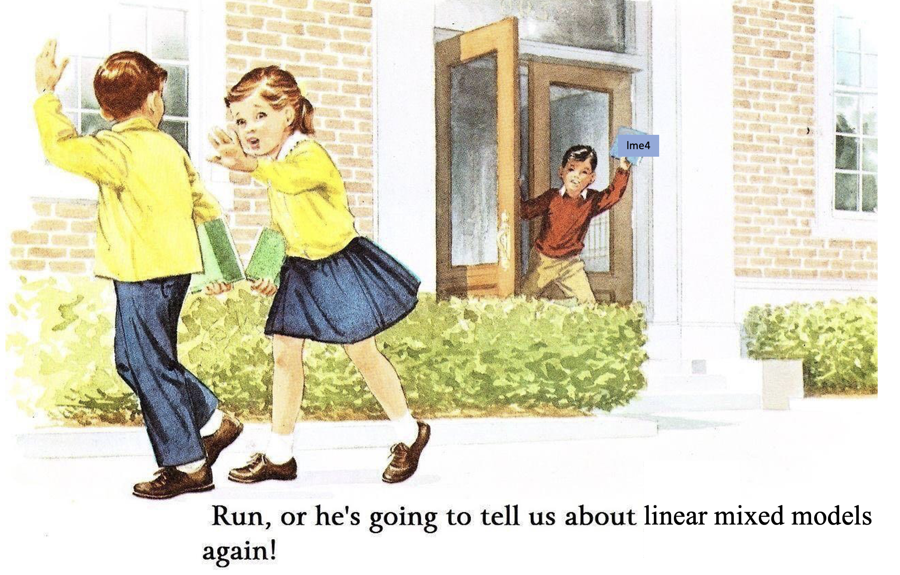

## February 2 and February 7, 2022: Linear models for analysis and prediction, multilevel models

[PDF of slides](./20220202_presentation_linmod.pdf) from in-class presentation.

R scripts for examples illustrated in class:

[20220202_anscombe.R](./20220202_anscombe.R)

[20220202_linearmodels.R](./20220202_linearmodels.R)

[20220202_LMM_example.R](./20220202_LMM_example.R)

[20220202_regression.R](./20220202_regression.R)

["babyrats.rds" data file for LMM example](/babyrats.rds)

#### Some helpful resources

[Linear Models with R](https://julianfaraway.github.io/faraway/LMR/) - This is my favorite linear models / regression text.

[Extending the Linear Model with R](https://julianfaraway.github.io/faraway/ELM/) - This is my favorite multilevel models text.

[Regression and Other Stories](./https://avehtari.github.io/ROS-Examples/) - This is an excellent text about regression modeling, mainly using Bayesian approaches. The full text is now available for free online.

[Formulae in R](https://conjugateprior.org/2013/01/formulae-in-r-anova/) - Very helpful tutorial about the model notation for "regular" and multilevel models - what the 1 is doing there in the random effects, etc.

[Regression assumptions in clinical psychology research practice — a systematic review of common misconceptions](https://www.ncbi.nlm.nih.gov/pmc/articles/PMC5436580/pdf/peerj-05-3323.pdf) - Ernst and Alberts (2017) Article that summarizes assumptions of linear regression models and surveys clinical psychology literature suggesting that most researchers are not paying attention to them. 

[Introducing linear mixed effects models](https://psyteachr.github.io/stat-models-v1/introducing-linear-mixed-effects-models.html) - Chapter from online textbook that introduces LMM approach through a slightly different motivation; may be useful complement to concepts discussed in class.

[Mixed Models with R: Getting started with random effects](https://m-clark.github.io/mixed-models-with-R/) - Tutorial/workshop materials that provides a great introduction to the topic.

[A solution to dependency: using multilevel analysis to accommodate nested data](./Aarts2014.pdf) - Conceptual overview of analyses of nested data.

[Beyond t test and ANOVA: applications of mixed-effects models for more rigorous statistical analysis in neuroscience research](./Yu2021.pdf) - Somewhat technical coverage of statistical approaches for dealing with nested data. 
